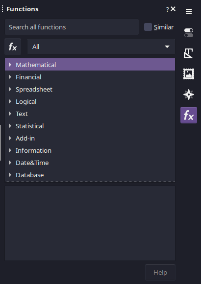
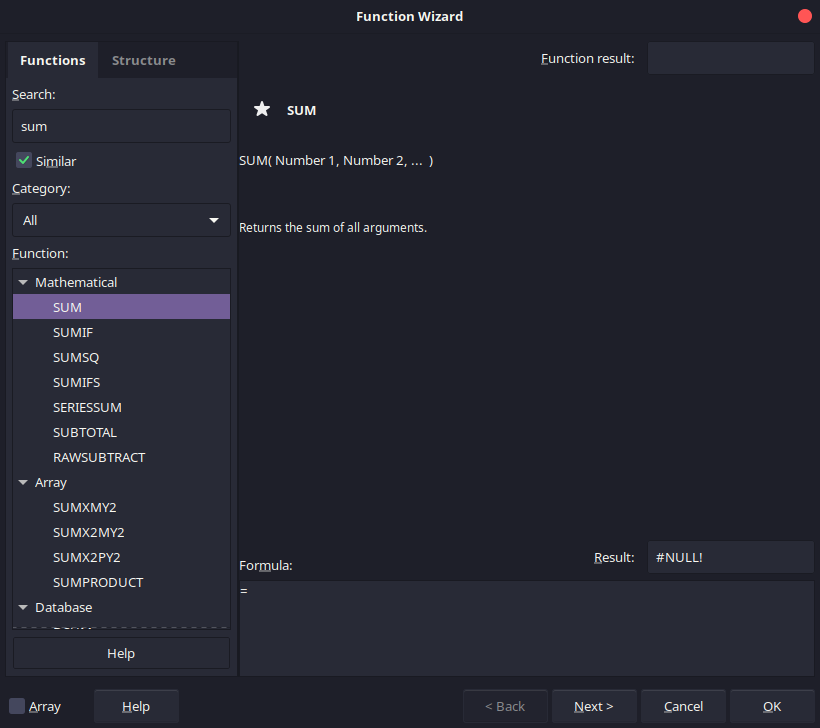

## Hello everyone!

I am excited to share my experience participating in the Google Summer of Code (GSoC) program this year. Being part of this incredible program has been both an enriching and rewarding journey. It provided me with the opportunity to collaborate with the open-source community and contribute to one of my favorite FOSS projects, LibreOffice.

LibreOffice Calc includes a convenient functions deck on the sidebar, allowing users to easily select from a variety of functions. While this panel is useful, there is significant room for improvement to further enhance its usability and functionality, creating a more seamless user experience.

The goal of my project was to introduce general improvements to the functions deck. However, we decided it would be more beneficial to apply these enhancements to both the Functions Deck (FD) and the Functions Wizard (FW). This presented some challenges, as the FD and FW reside in different modules and are built with distinct code structures.

Working within such a complex codebase was a real challenge. Much of my time was spent figuring out where to implement changes, alongside many hours of debugging. On the positive side, this experience has significantly improved my debugging skills, particularly through the use of advanced tools like rr, which builds on gdb.

***Project Goals:***
  - List all functions in collapsible sections (rather the current filtering per dropdown)
  - Add a help button to open the respective documentation page
  - Improve searching techniques

***Abandoned Goals:***
  - Save custom made formulas, to be used anywhere
  - Add an editor area that provides structure of the function, with:
    - Syntax highlighting and formatting – with connection to referenced cells
    - Ability to drill down for better debugging process

[Link to The meta-bug ticket on Bugzilla](https://bugs.documentfoundation.org/show_bug.cgi?id=92416)

My Work & Progress
==================
My work was splitted into seperate tasks conserning every proposed enhancement.

> Note: you can go to the bug ticket on Bugzilla by clicking on tdf#***** at the begining of the commit message.

***Converting functions list into collapsible sections*** -->
[Patch link](https://gerrit.libreoffice.org/c/core/+/169639)  

***Adding a help button to open respective help documentation*** ->
[Patch link](https://gerrit.libreoffice.org/c/core/+/170181) - 
[Bug fix](https://gerrit.libreoffice.org/c/core/+/171929)

***Enhancing searching functionality - adding similarity search*** ->
[Patch link](https://gerrit.libreoffice.org/c/core/+/170073)

***Adding a category to store favorite functions*** ->
[Patch link](https://gerrit.libreoffice.org/c/core/+/171828)

***Making Initial focus to be in the document when creating a new sheet*** ->
[Patch link](https://gerrit.libreoffice.org/c/core/+/171709)

Futrue Work
-----------

- *Cycling between absolute and relative references everywhere using F4 Key* ->
[Bug Link](https://bugs.documentfoundation.org/show_bug.cgi?id=162287)

- *Adding typical keyboard shortcuts*

Screenshots of the enhancements
-------------------------------
### The Function Deck

### The Function Wizard

------------------------------------------------------

Working on this project has been an incredibly rewarding and challenging experience. I thoroughly enjoyed every aspect of it and am eager to continue contributing to LibreOffice and the open-source community at large.

I would like to express my sincere gratitude to the entire community for their invaluable help and collaboration. Special thanks go to my mentors, Andreas Heinisch and Heiko Tietze, for their continuous guidance and support throughout the project. Their expertise and mentorship have been instrumental in my growth and development.